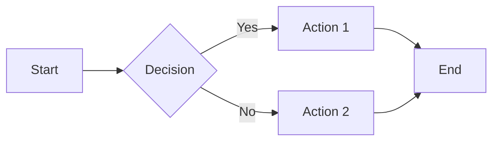
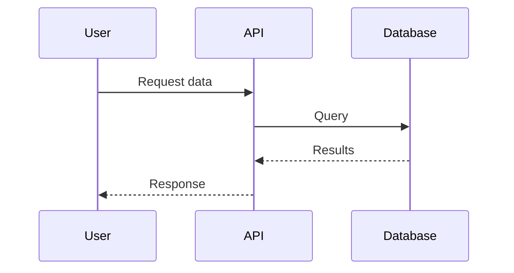
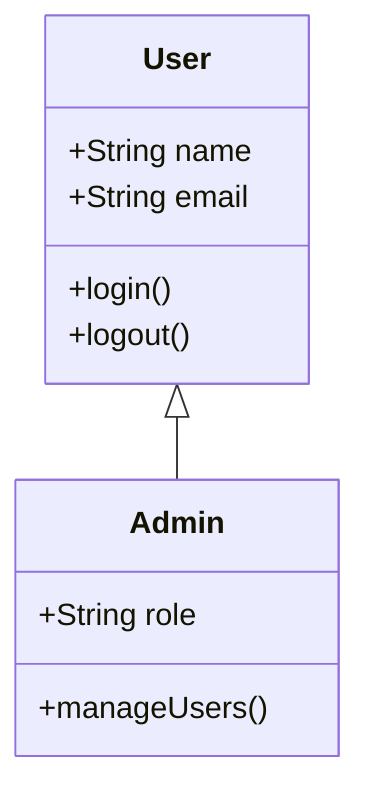
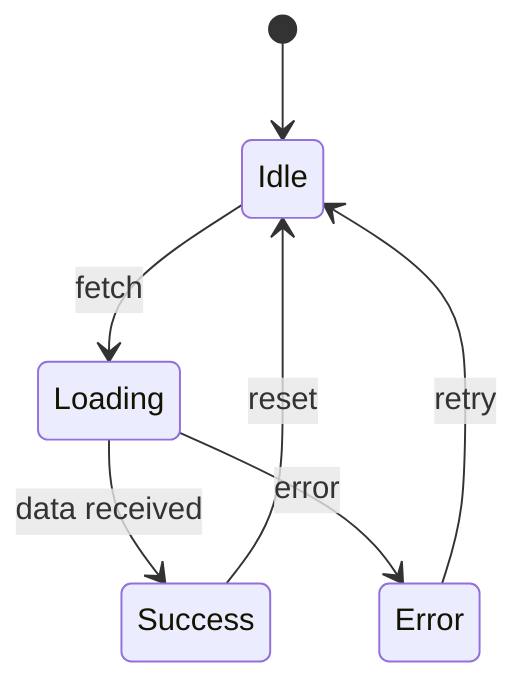
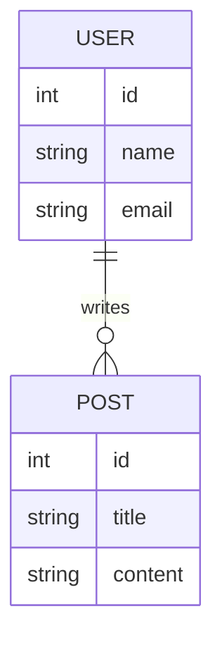

# Mermaid Diagram Examples

## Flowchart

```mermaid
flowchart LR
    A[Start] --> B{Decision}
    B -->|Yes| C[Action 1]
    B -->|No| D[Action 2]
    C --> E[End]
    D --> E
```

## Sequence Diagram

```mermaid
sequenceDiagram
    participant User
    participant API
    participant Database

    User->>API: Request data
    API->>Database: Query
    Database-->>API: Results
    API-->>User: Response
```

## Class Diagram

```mermaid
classDiagram
    class User {
        +String name
        +String email
        +login()
        +logout()
    }
    class Admin {
        +String role
        +manageUsers()
    }
    User <|-- Admin
```

## State Diagram

```mermaid
stateDiagram-v2
    [*] --> Idle
    Idle --> Loading: fetch
    Loading --> Success: data received
    Loading --> Error: error
    Success --> Idle: reset
    Error --> Idle: retry
```

## Entity Relationship

```mermaid
erDiagram
    USER ||--o{ POST : writes
    USER {
        int id
        string name
        string email
    }
    POST {
        int id
        string title
        string content
    }
```
