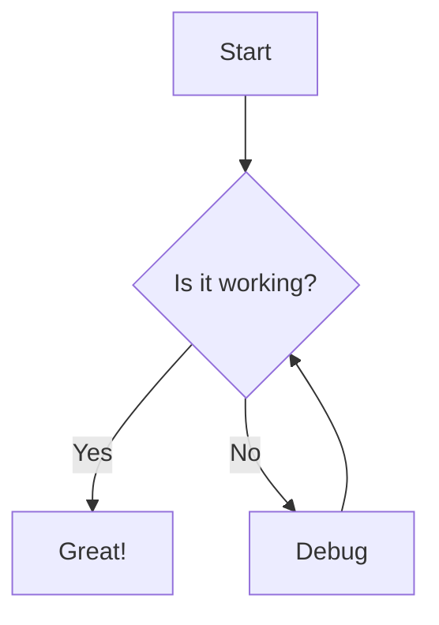

import type { ComponentProps } from 'react'
import { Button, Card } from '@/components'

export const metadata = {
  description: 'A sample MDX document for testing',
}

# Sample MDXLD Document

This is a **sample** MDX document with _various_ formatting.

## Code Blocks

```typescript {title="example.ts"}
interface User {
  name: string
  email: string
}

function greet(user: User): string {
  return `Hello, ${user.name}!`
}
```

```sql
SELECT * FROM users
WHERE active = true
ORDER BY created_at DESC
```



## Inline Templates

Here's some inline YAML: yaml`key: value, nested: { a: 1 }`

And some SQL: sql`SELECT * FROM users WHERE id = 1`

## JSX Components

<Card title="Example Card">
  <Button onClick={() => console.log('clicked')}>
    Click me
  </Button>
</Card>

## Lists

- [x] Task 1
- [ ] Task 2
- [ ] Task 3

1. First item
2. Second item
3. Third item

> This is a blockquote
> with multiple lines

## Links

[Example Link](https://example.com)

~~This text is strikethrough~~
